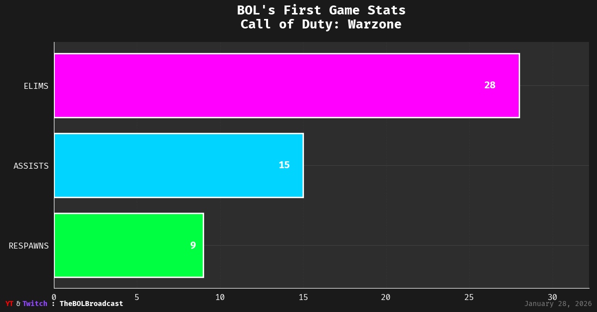
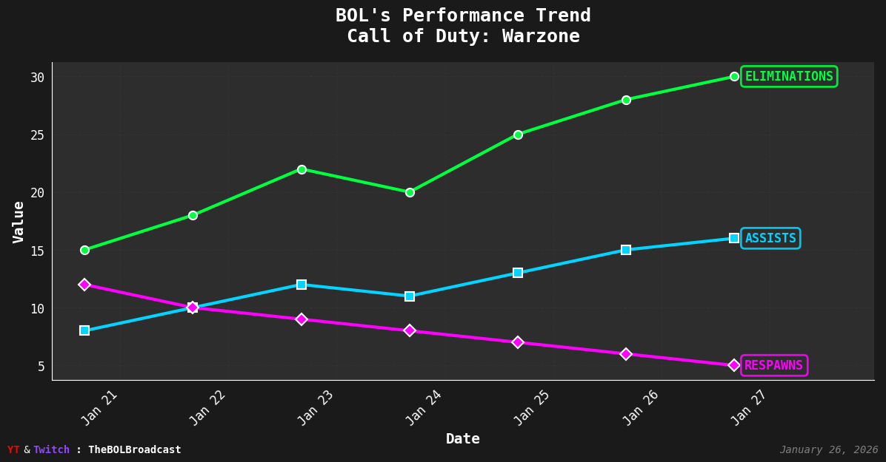
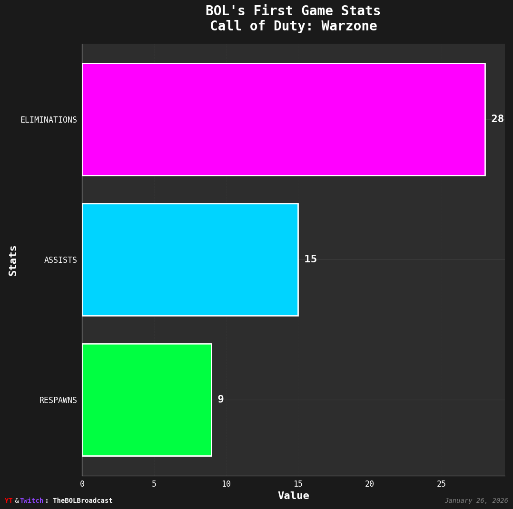
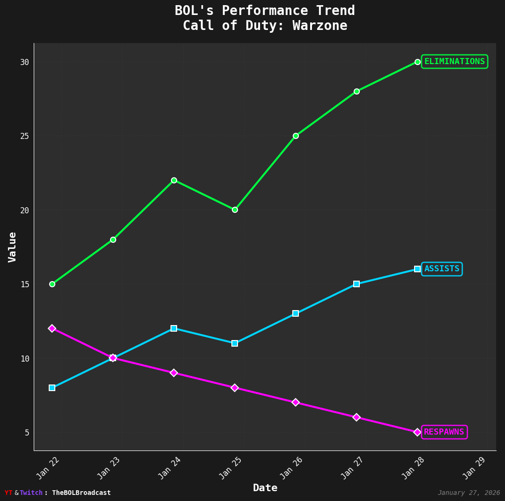
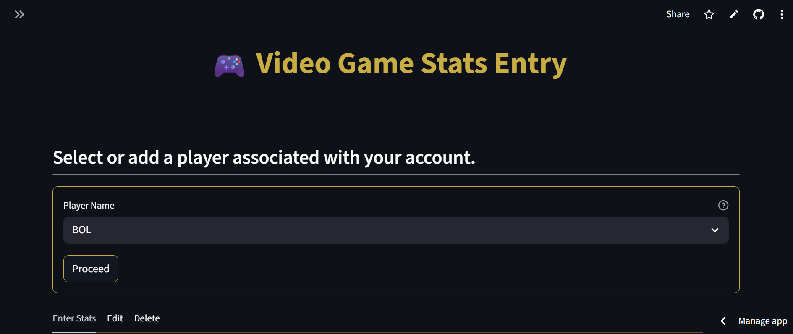
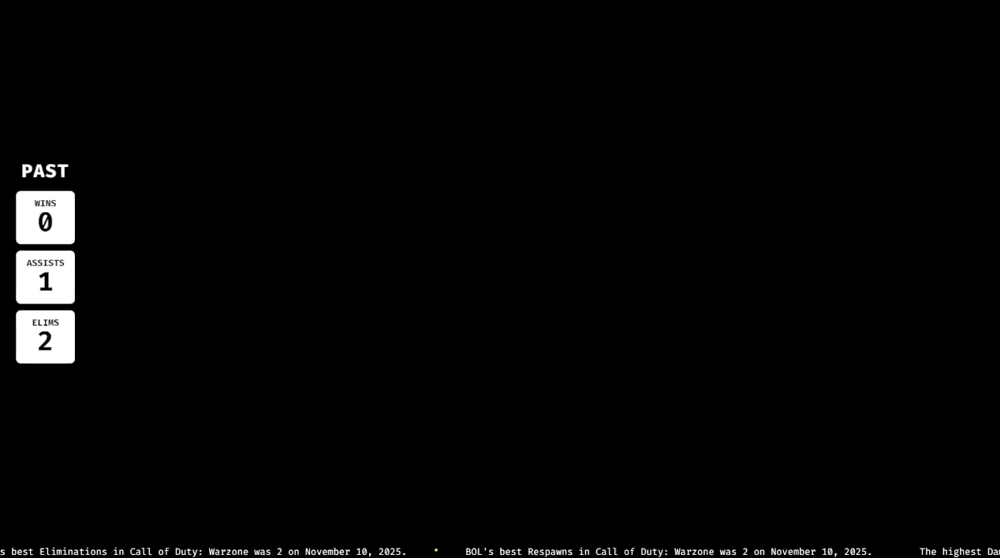
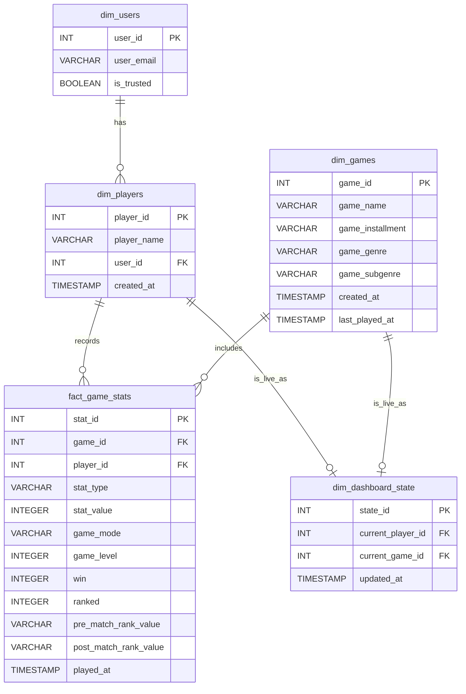

# 🎮 Video Game Stats Tracker (Full Stack)

A full-stack web application built to **log, track, and analyze video game statistics**.

This app uses:
- **Frontend:** Streamlit (Python)
- **Backend:** Flask API
- **Database:** AWS Redshift Serverless (star schema)
- **Overlay Dashboard:** GitHub Pages (HTML/CSS/JS)

---

## 🚀 Live Application
🔗 [Video Game Stats Entry](https://video-game-stats-tracking.streamlit.app/)

🔗 [Live Overlay Dashboard](https://b-i-king.github.io/Video_Game_Stats_Tracker/index.html)

---

## 📸 Social Media Previews

Get a glimpse of the application in action across different platforms:

### Twitter Card Preview
*Optimized for Twitter's large summary card (1200x630)*

#### Bar Chart - Statistical Breakdown


#### Line Chart - Performance Over Time



### Instagram Post Preview
*Optimized for Instagrams's post format (1080x1080)*

#### Bar Chart - Statistical Breakdown


#### Line Chart - Performance Over Time



### Application Screenshot

*Main stats entry interface with Google OAuth*

---

## 🎥 Live Demo

Watch the ESPN-style overlay in action during a live stream or recording:



*Real-time stats overlay updating during gameplay*

---

## 🏩 Application Architecture

**Frontend (Streamlit):**
- Python web app deployed on Streamlit Community Cloud.
- Handles Google OAuth authentication (`st.login("google")`).
- Manages UI, user sessions, and API communication.

**Backend (Flask API):**
- Python API hosted on Render.
- Manages business logic, JWT-based authentication, and CRUD operations.

**Database (AWS Redshift Serverless):**
- Stores all analytical data in a **star schema** with `dim` and `fact` tables.

**Overlay Dashboard (GitHub Pages):**
- HTML/CSS/JS static site hosted via GitHub Pages.
- Fetches real-time stats from Flask API.
- Designed for OBS Browser Source integration.

---

## 🔐 Authentication Flow

1. User logs in via **Google OAuth** using `st.login("google")`.
2. Streamlit receives the user email → checks if trusted.
3. If trusted → requests a **JWT** from Flask `/login`.
4. If not trusted → calls `/add_user` to register a guest user.
5. Flask issues a short-lived **JWT** with user role info.
6. Streamlit uses JWT for authenticated API calls (via `Authorization: Bearer <token>`).

---

## ✨ Key Features

- 🔑 **Google Authentication** (with JWT + API Key security)
- 🧩 **CRUD for Admins:**
  - Add/edit/delete players, games, and stats
- 💫 **Star Schema Design** for analytics efficiency
- ⚡ **Fast Backend Connections** with psycopg2 connection pooling
- 🧠 **Smart UI:**
  - Hybrid inputs (dropdown + text)
  - Dependent dropdowns (Genre → Subgenre)
  - Safe multi-step delete confirmation

---

## 📺 OBS Streaming Overlay Setup

### What is it?
The overlay dashboard displays real-time game statistics in an ESPN-style format during live streams. It pulls data from your Flask API and updates automatically.

### Step-by-Step Implementation

#### 1. Get Your Overlay URL
Your GitHub Pages overlay is hosted at:
```
https://[your-github-username].github.io/[repository-name]/index.html?key=YOUR_OBS_KEY
```

**Example:**
```
https://b-i-king.github.io/Video_Game_Stats_Tracker/index.html?key=abc123xyz789
```

> **⚠️ Important:** Replace `YOUR_OBS_KEY` with the actual OBS key from your Render environment variables. This key authenticates your overlay with the Flask API.

#### 2. Add Browser Source in OBS

1. **Open OBS Studio**
2. **In Sources panel → Click `+` → Select `Browser`**
3. **Configure the Browser Source:**
   - **Name:** `Game Stats Overlay`
   - **URL:** `https://[your-github-username].github.io/[repo-name]/index.html?key=YOUR_OBS_KEY`
   - **Width:** `1920`
   - **Height:** `1080`
   - **FPS:** `30` (or match your stream FPS)
   - ✅ **Check:** "Shutdown source when not visible" (saves resources)
   - ✅ **Check:** "Refresh browser when scene becomes active"

4. **Custom CSS (Optional):**
   ```css
   body { 
     background-color: rgba(0, 0, 0, 0); 
     margin: 0px auto; 
     overflow: hidden; 
   }
   ```

#### 3. Position and Resize

- **Drag** the overlay to your desired position (typically bottom-third or corner)
- **Right-click** → `Transform` → `Edit Transform` for precise positioning
- Use **Alt + Drag** to crop specific sections if needed

#### 4. Testing the Overlay

- **Preview in OBS:** The overlay should appear over your game capture
- **Check API Connection:** Open browser console (Right-click source → `Interact`)
- **Verify Data Flow:** Stats should update when you log new games in Streamlit

#### 5. Troubleshooting

**Problem:** "Error: URL is missing key parameter"  
**Solution:** Add `?key=YOUR_OBS_KEY` to the end of your GitHub Pages URL. Get the key from your Render environment variables.

**Problem:** Overlay not showing  
**Solution:** Check GitHub Pages deployment status and ensure `index.html` is in the correct directory

**Problem:** Stats not updating  
**Solution:** Verify Flask API is running at `https://video-game-stats-api.onrender.com` and check CORS settings. Ensure your OBS key matches the one in Render.

**Problem:** Overlay looks blurry  
**Solution:** Increase the width/height in Browser Source settings or check your base canvas resolution

**Problem:** "Unauthorized" or "403 Forbidden" errors  
**Solution:** Double-check that the OBS key in your URL matches exactly with the key stored in Render's environment variables

---

## 🏷 How to Run Locally

### Prerequisites
- Python 3.9+
- AWS Redshift Serverless database
- Google Cloud project with OAuth 2.0 credentials (`http://localhost:8501`)
- Separate `requirements.txt` files for backend and frontend

---

### 1️⃣ Backend (Flask)

```bash
cd /your-project-folder/backend

# requirements.txt
Flask
psycopg2-binary
PyJWT
gunicorn
flask-cors

# Install dependencies
pip install -r requirements.txt
```

Create a `.env` file (excluded via `.gitignore`):

```env
DB_URL=your-redshift-endpoint.amazonaws.com
DB_NAME=dev
DB_USER=admin
DB_PASSWORD=your-password
API_KEY=your-random-api-key
JWT_SECRET_KEY=your-random-secret
TRUSTED_EMAILS=user1@gmail.com,user2@gmail.com
```

Run the Flask app:
```bash
python flask_app.py
```
> Flask starts and creates tables automatically.

---

### 2️⃣ Frontend (Streamlit)

```bash
cd /your-project-folder/frontend

# requirements.txt
streamlit
requests
psycopg2-binary
pandas
sqlalchemy

# Install dependencies
pip install -r requirements.txt
```

Create Streamlit secrets in `.streamlit/secrets.toml`:

```toml
[flask]
flask_api_url = "http://127.0.0.1:5000/api"

[redshift]
database_url = "your-redshift-url.amazonaws.com"
database_name = "dev"
database_user = "admin"
database_password = "your-password"

[config]
api_key = "your-same-api-key-from-step-1"
trusted_emails = ["your-admin-email@gmail.com"]
```

Run Streamlit app:
```bash
streamlit run streamlit_app.py
```

---

## 🧱 Project Structure & New Pages

**`utils.py`** — Central utility module storing key functions, constants, and reusable variables for both backend and frontend logic.

**Home Page** — A welcoming landing page that introduces users to the application, its purpose, and navigation links.

**Stats Page** — Allows authenticated users to log, edit, and view video game statistics. Integrated with backend CRUD endpoints for dynamic updates.

**Privacy Policy Page** — Provides details about user data handling and security, required for **Google OAuth verification**.

**Terms of Service Page** — Outlines acceptable use, user responsibilities, and account management terms to comply with **Google API verification requirements**.

---

## 🧩 Entity Relationship Diagram (ERD)

### Mermaid Diagram



---

## 🗂 File Summary

- `README.md` → Project Overview & Setup
- `Data_Dictonary.md` → Database Schema Reference
- `ER_Diagram.md` → Entity-Relationship Diagram Reference

---

## 🎓 Tutorials & Resources

🔗 Don’t forget to check out my tutorials and live demos on YouTube:
- [The BOL Guide](https://www.youtube.com/@TheBOLGuide)
- [The BOL Broadcast](https://www.youtube.com/@TheBOLBroadcast)

---

## 📧 Contact

For questions or support, reach out via:
- GitHub Issues
- YouTube comments on [The BOL Guide](https://www.youtube.com/@TheBOLGuide)
