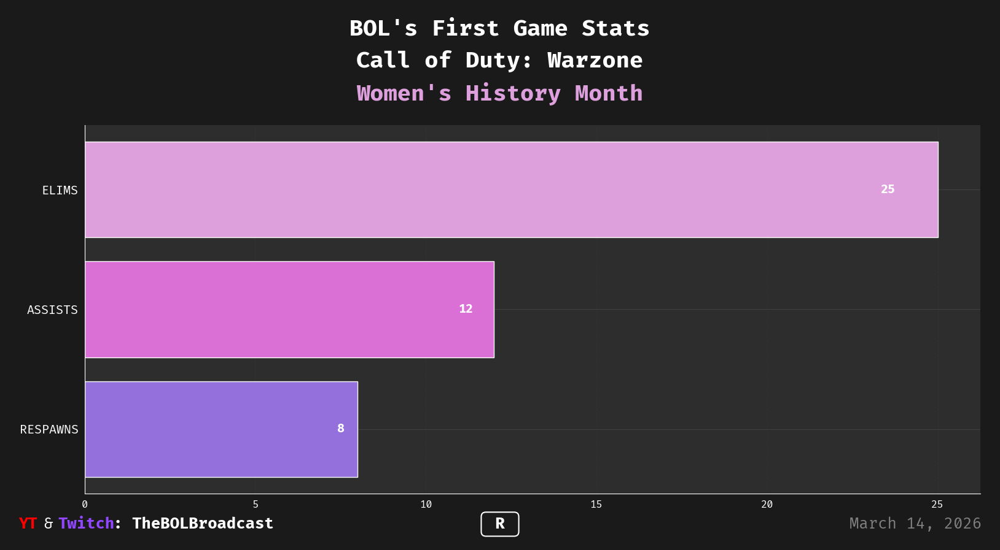
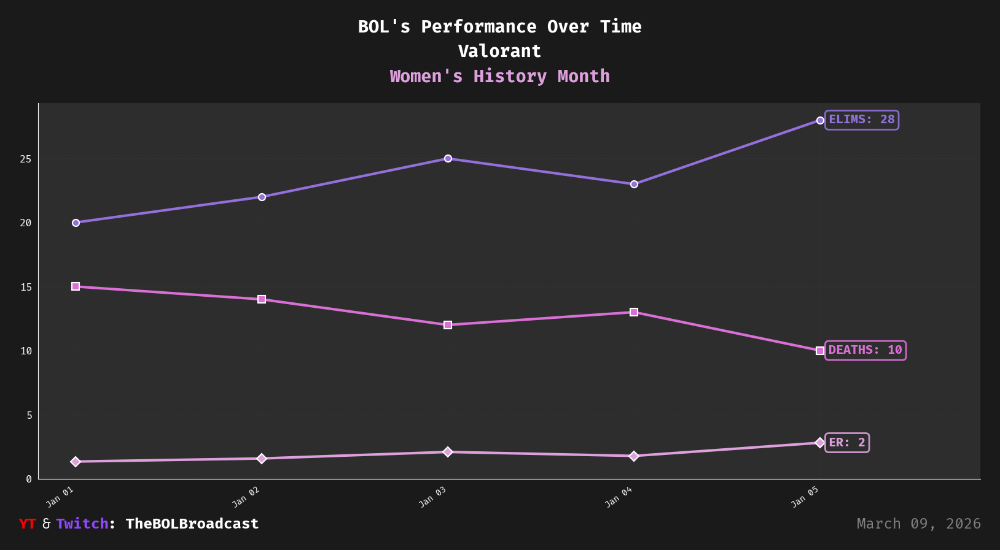
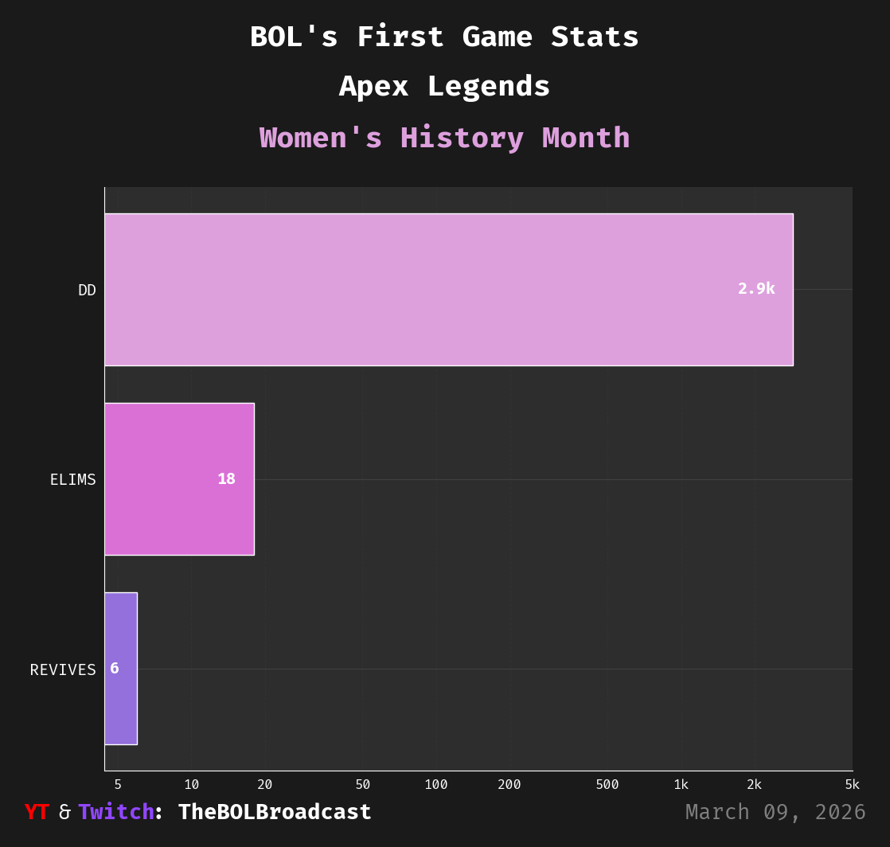
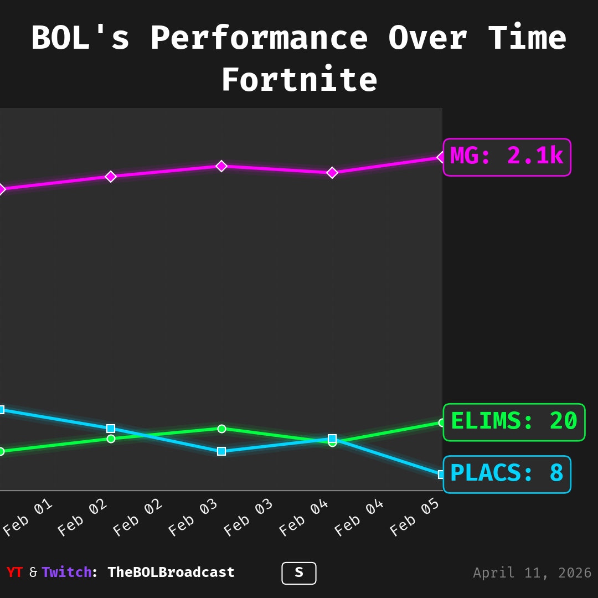
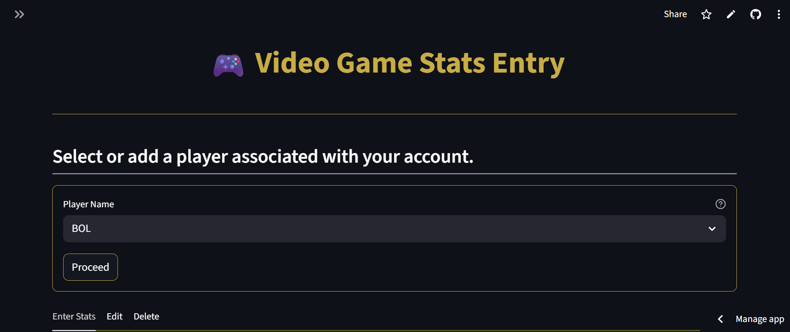
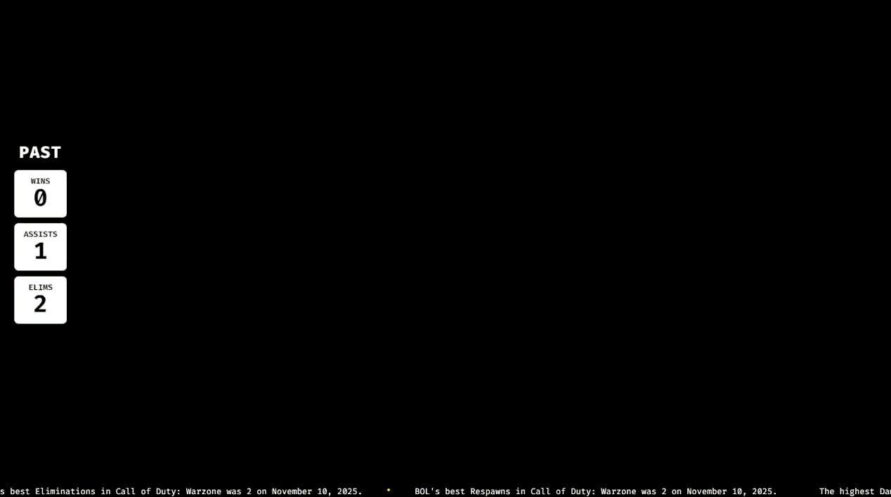
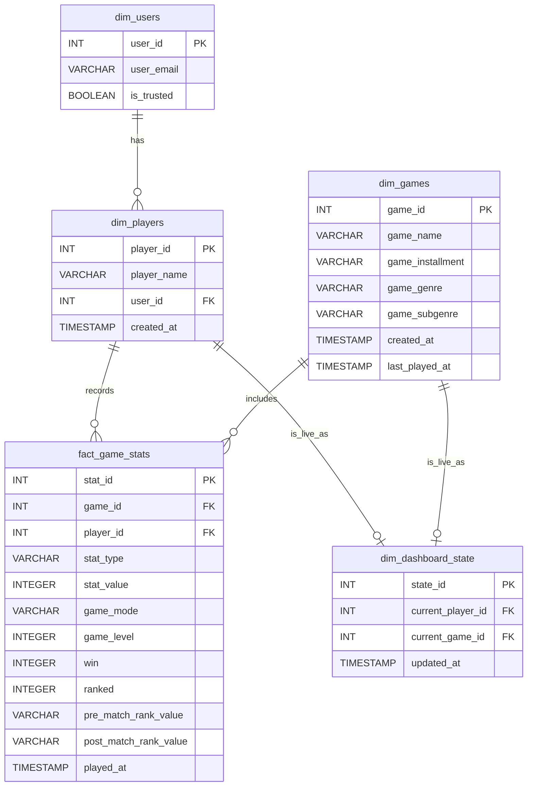

# 🎮 Video Game Stats Tracker (Full Stack)

A full-stack application built to **log, track, and analyze video game statistics** — with automated social media posting, live stream overlays, and a mobile companion app.

This app uses:
- **Web Frontend:** Streamlit (Python)
- **Mobile App:** React Native + Expo (iOS, Android, Web)
- **Backend:** Flask API (hosted on Render)
- **Database:** AWS Redshift Serverless (star schema)
- **Queue Storage:** Neon Serverless Postgres (post queue)
- **File Storage:** Google Cloud Storage (chart images, interactive charts)
- **Overlay Dashboard:** GitHub Pages (HTML/CSS/JS)
- **Social Media:** IFTTT webhooks → Twitter & Instagram

---

## 🚀 Live Application
🔗 [Video Game Stats Entry](https://video-game-stats-tracking.streamlit.app/)

🔗 [Live Overlay Dashboard](https://b-i-king.github.io/Video_Game_Stats_Tracker/index.html)

---

## 📸 Social Media Previews

Get a glimpse of the application in action across different platforms:

### Twitter Card Preview
*Optimized for Twitter's large summary card (1200x630)*

#### Bar Chart - Statistical Breakdown


#### Line Chart - Performance Over Time



### Instagram Post Preview
*Optimized for Instagrams's post format (1080x1080)*

#### Bar Chart - Statistical Breakdown


#### Line Chart - Performance Over Time



### Application Screenshot

*Main stats entry interface with Google OAuth*

---

## 🎥 Live Demo

Watch the ESPN-style overlay in action during a live stream or recording:



*Real-time stats overlay updating during gameplay*

---

## 🏩 Application Architecture

**Web Frontend (Streamlit):**
- Python web app deployed on Streamlit Community Cloud.
- Handles Google OAuth authentication (`st.login("google")`).
- Manages UI, user sessions, and API communication.

**Mobile App (React Native + Expo):**
- Single codebase targeting iOS, Android, and web.
- Stat entry, history, dashboard WebView, leaderboard (Supabase), and profile screens.
- Push notifications via Expo Push (free).
- JWT stored securely via `expo-secure-store`.
- Source lives in `mobile/`.

**Backend (Flask API):**
- Python API hosted on Render.
- Manages business logic, JWT-based authentication, and CRUD operations.
- Generates static chart images (Matplotlib → GCS) and interactive charts (Plotly HTML → GCS).

**Database (AWS Redshift Serverless):**
- Stores all analytical data in a **star schema** with `dim` and `fact` tables.
- Auto-pauses after inactivity to minimize RPU billing.

**Post Queue (Neon Serverless Postgres):**
- Posts submitted during business hours (9am–5pm PST, weekdays) are queued.
- GitHub Actions cron releases queued posts every 30 minutes after 5pm.
- Manual queue bypass toggle available for trusted users in the Streamlit sidebar.

**Social Media Automation:**
- IFTTT webhooks post chart images to Twitter and Instagram.
- Twitter captions include a link to the interactive Plotly chart hosted on GCS.
- Instagram 60-day access tokens are auto-refreshed monthly via GitHub Actions + AWS Secrets Manager.

**Overlay Dashboard (GitHub Pages):**
- HTML/CSS/JS static site hosted via GitHub Pages.
- Fetches real-time stats from Flask API.
- Designed for OBS Browser Source integration.

---

## 🔐 Authentication Flow

1. User logs in via **Google OAuth** using `st.login("google")`.
2. Streamlit receives the user email → checks if trusted.
3. If trusted → requests a **JWT** from Flask `/login`.
4. If not trusted → calls `/add_user` to register a guest user.
5. Flask issues a short-lived **JWT** with user role info.
6. Streamlit uses JWT for authenticated API calls (via `Authorization: Bearer <token>`).

---

## ✨ Key Features

- 🔑 **Google Authentication** (with JWT + API Key security)
- 📱 **Mobile App** — React Native + Expo for iOS, Android, and web
- 🧩 **CRUD for Admins:** Add/edit/delete players, games, and stats
- 📊 **Auto-Generated Charts:** Matplotlib bar/line charts + Plotly interactive charts uploaded to GCS
- 📬 **Smart Post Queue:** Business-hours gating with 30-minute release intervals after 5pm PST
- 🐦 **Twitter & Instagram Automation** via IFTTT webhooks with holiday-themed captions
- 📈 **Interactive Stats Link** appended to every Twitter post (Plotly HTML on GCS)
- 💫 **Star Schema Design** for analytics efficiency
- ⚡ **Fast Backend Connections** with psycopg2 connection pooling
- 🧠 **Smart UI:**
  - Hybrid inputs (dropdown + text)
  - Dependent dropdowns (Genre → Subgenre)
  - Safe multi-step delete confirmation

---

## 📺 OBS Streaming Overlay Setup

### What is it?
The overlay dashboard displays real-time game statistics in an ESPN-style format during live streams. It pulls data from your Flask API and updates automatically.

### Step-by-Step Implementation

#### 1. Get Your Overlay URL
Your GitHub Pages overlay is hosted at:
```
https://[your-github-username].github.io/[repository-name]/index.html?key=YOUR_OBS_KEY
```

**Example:**
```
https://b-i-king.github.io/Video_Game_Stats_Tracker/index.html?key=abc123xyz789
```

> **⚠️ Important:** Replace `YOUR_OBS_KEY` with the actual OBS key from your Render environment variables. This key authenticates your overlay with the Flask API.

#### 2. Add Browser Source in OBS

1. **Open OBS Studio**
2. **In Sources panel → Click `+` → Select `Browser`**
3. **Configure the Browser Source:**
   - **Name:** `Game Stats Overlay`
   - **URL:** `https://[your-github-username].github.io/[repo-name]/index.html?key=YOUR_OBS_KEY`
   - **Width:** `1920`
   - **Height:** `1080`
   - **FPS:** `30` (or match your stream FPS)
   - ✅ **Check:** "Shutdown source when not visible" (saves resources)
   - ✅ **Check:** "Refresh browser when scene becomes active"

4. **Custom CSS (Optional):**
   ```css
   body { 
     background-color: rgba(0, 0, 0, 0); 
     margin: 0px auto; 
     overflow: hidden; 
   }
   ```

#### 3. Position and Resize

- **Drag** the overlay to your desired position (typically bottom-third or corner)
- **Right-click** → `Transform` → `Edit Transform` for precise positioning
- Use **Alt + Drag** to crop specific sections if needed

#### 4. Testing the Overlay

- **Preview in OBS:** The overlay should appear over your game capture
- **Check API Connection:** Open browser console (Right-click source → `Interact`)
- **Verify Data Flow:** Stats should update when you log new games in Streamlit

#### 5. Troubleshooting

**Problem:** "Error: URL is missing key parameter"  
**Solution:** Add `?key=YOUR_OBS_KEY` to the end of your GitHub Pages URL. Get the key from your Render environment variables.

**Problem:** Overlay not showing  
**Solution:** Check GitHub Pages deployment status and ensure `index.html` is in the correct directory

**Problem:** Stats not updating  
**Solution:** Verify Flask API is running at `https://video-game-stats-api.onrender.com` and check CORS settings. Ensure your OBS key matches the one in Render.

**Problem:** Overlay looks blurry  
**Solution:** Increase the width/height in Browser Source settings or check your base canvas resolution

**Problem:** "Unauthorized" or "403 Forbidden" errors  
**Solution:** Double-check that the OBS key in your URL matches exactly with the key stored in Render's environment variables

---

## 🏷 How to Run Locally

### Prerequisites
- Python 3.9+
- AWS Redshift Serverless database
- Google Cloud project with OAuth 2.0 credentials (`http://localhost:8501`)
- Separate `requirements.txt` files for backend and frontend

---

### 1️⃣ Backend (Flask)

```bash
cd /your-project-folder/backend

# requirements.txt
Flask
psycopg2-binary
PyJWT
gunicorn
flask-cors

# Install dependencies
pip install -r requirements.txt
```

Create a `.env` file (excluded via `.gitignore`):

```env
DB_URL=your-redshift-endpoint.amazonaws.com
DB_NAME=dev
DB_USER=admin
DB_PASSWORD=your-password
API_KEY=your-random-api-key
JWT_SECRET_KEY=your-random-secret
TRUSTED_EMAILS=user1@gmail.com,user2@gmail.com
```

Run the Flask app:
```bash
python flask_app.py
```
> Flask starts and creates tables automatically.

---

### 2️⃣ Frontend (Streamlit)

```bash
cd /your-project-folder/frontend

# requirements.txt
streamlit
requests
psycopg2-binary
pandas
sqlalchemy

# Install dependencies
pip install -r requirements.txt
```

Create Streamlit secrets in `.streamlit/secrets.toml`:

```toml
[flask]
flask_api_url = "http://127.0.0.1:5000/api"

[redshift]
database_url = "your-redshift-url.amazonaws.com"
database_name = "dev"
database_user = "admin"
database_password = "your-password"

[config]
api_key = "your-same-api-key-from-step-1"
trusted_emails = ["your-admin-email@gmail.com"]
```

Run Streamlit app:
```bash
streamlit run streamlit_app.py
```

---

## 🧱 Project Structure

```
Game_Tracker/
├── flask_app.py                  # Flask REST API
├── pages/                        # Streamlit pages
│   ├── 1_Home.py
│   ├── 2_Stats.py                # Main stat entry UI
│   └── ...
├── utils/                        # Shared Python utilities
│   ├── chart_utils.py            # Matplotlib + Plotly chart generation
│   ├── gcs_utils.py              # Google Cloud Storage uploads
│   ├── ifttt_utils.py            # Social media caption + webhook
│   ├── queue_utils.py            # Neon Postgres post queue
│   ├── instagram_token_utils.py  # Instagram token auto-refresh
│   ├── game_handles_utils.py     # Game-specific handles + hashtags
│   └── holiday_themes.py         # Holiday/heritage color themes
├── mobile/                       # React Native + Expo mobile app
│   ├── src/screens/              # App screens
│   ├── src/components/           # Reusable UI components
│   ├── src/hooks/                # useStats, useTicker
│   ├── src/api/                  # Flask API wrappers
│   ├── src/auth/                 # JWT auth context
│   └── src/notifications/        # Expo push notifications
├── .github/workflows/            # GitHub Actions
│   ├── process_queue.yml         # Cron: release queued posts at 5pm PST
│   ├── refresh_instagram_token.yml # Cron: refresh Instagram token monthly
│   └── gcs_cleanup.yml           # Cron: clean up old GCS chart files
├── docs/                         # Implementation guides and references
│   └── bar_chart_race.md         # Animated stats visualization (Flourish / Power BI)
├── assets/                       # README images, SQL, captions
└── requirements.txt              # Python dependencies
```

---

## 🧩 Entity Relationship Diagram (ERD)

### Mermaid Diagram


```mermaid
erDiagram
    dim_users {
        INT user_id PK
        VARCHAR user_email
        BOOLEAN is_trusted
    }
    dim_players {
        INT player_id PK
        VARCHAR player_name
        INT user_id FK
        TIMESTAMP created_at
    }
    dim_games {
        INT game_id PK
        VARCHAR game_name
        VARCHAR game_installment
        VARCHAR game_genre
        VARCHAR game_subgenre
        TIMESTAMP created_at
        TIMESTAMP last_played_at
    }
    dim_dashboard_state {
        INT state_id PK
        INT current_player_id FK
        INT current_game_id FK
        TIMESTAMP updated_at
    }
    fact_game_stats {
        INT stat_id PK
        INT game_id FK
        INT player_id FK
        VARCHAR stat_type
        INTEGER stat_value
        VARCHAR game_mode
        INTEGER game_level
        INTEGER win
        INTEGER ranked
        VARCHAR pre_match_rank_value
        VARCHAR post_match_rank_value
        TIMESTAMP played_at
    }
    dim_users ||--o{ dim_players : "has"
    dim_players ||--o{ fact_game_stats : "records"
    dim_games ||--o{ fact_game_stats : "includes"
    dim_players ||--o| dim_dashboard_state : "is_live_as"
    dim_games ||--o| dim_dashboard_state : "is_live_as"
```

---

## 🗂 File Summary

- `README.md` → Project Overview & Setup
- `Data_Dictonary.md` → Database Schema Reference
- `ER_Diagram.md` → Entity-Relationship Diagram Reference

---

## 🎓 Tutorials & Resources

🔗 Don’t forget to check out my tutorials and live demos on YouTube:
- [The BOL Guide](https://www.youtube.com/@TheBOLGuide)
- [The BOL Broadcast](https://www.youtube.com/@TheBOLBroadcast)

---

## 📧 Contact

For questions or support, reach out via:
- GitHub Issues
- YouTube comments on [The BOL Guide](https://www.youtube.com/@TheBOLGuide)
